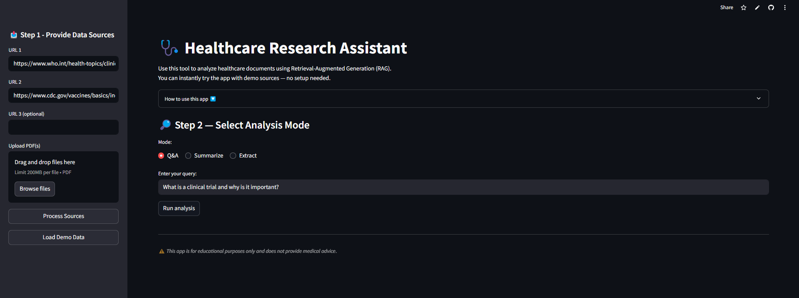
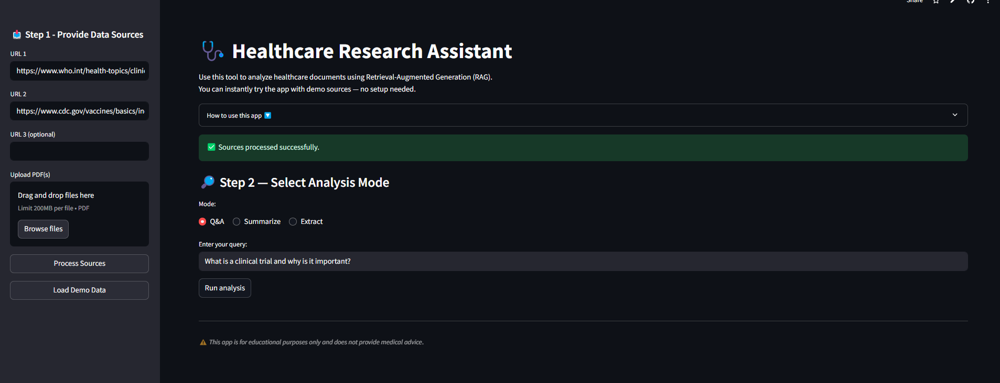
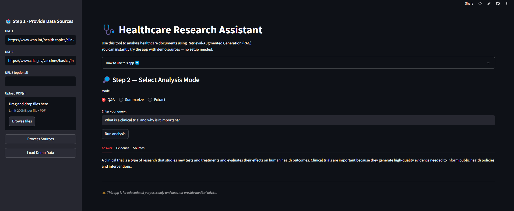
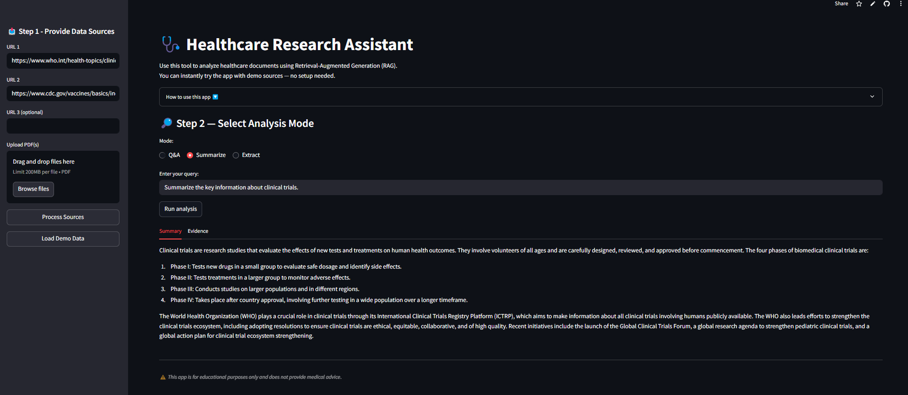
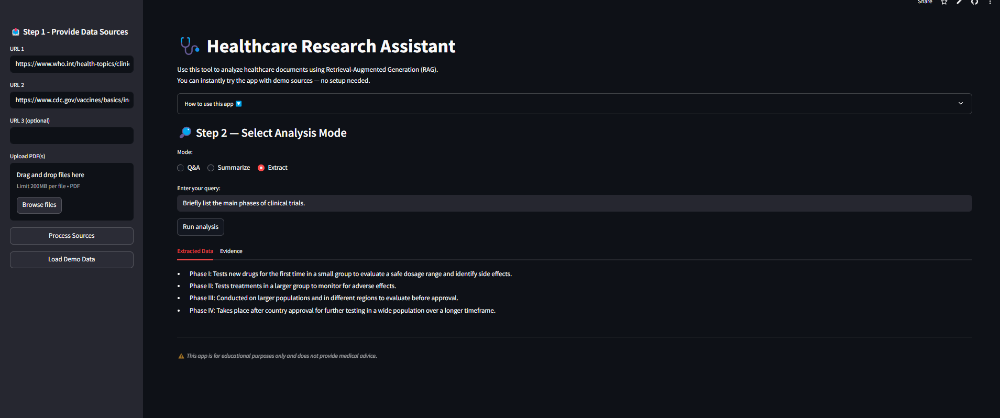

<div align="center">
<h1 align="center"> 🩺 Healthcare Research Assistant </h1>

[](https://healthcare-research-assistant.streamlit.app)


[](https://groq.com/)
[](https://www.trychroma.com/)


</div>


<p align="center">
  <a href="#overview">Overview</a> •
  <a href="#live-demo">Live Demo</a> •
  <a href="#features">Features</a> •

  <a href="#app-usage">App Usage</a> •
  <a href="#tech-stack">Tech Stack</a> •
  <a href="#installation">Installation</a> •
  <a href="#acknowledgements">Acknowledgements</a> •
  <a href="#license">License</a>
</p>

<div align="center">

An AI-Powered Retrieval-Augmented Generation (RAG) Application for Healthcare Knowledge Exploration



</div>

---

## 🚀 Overivew <a name="overview"></a>

The **Healthcare Research Assistant** is an AI-powered Retrieval-Augmented Generation (RAG) tool designed to help users explore healthcare information quickly and reliably. By combining document ingestion, vector search, and LLM reasoning, the app can analyze clinical articles, guidelines, and research PDFs—producing grounded answers, summaries, and structured insights with clear evidence citations.

Inspired by the Real Estate Analyst RAG App built during the Codebasics GenAI Bootcamp, this project extends those concepts into a high-impact healthcare use case, aligning AI capabilities with the needs of modern healthcare analytics.

## ❗ Problem Statement

Healthcare professionals, analysts, and students often struggle to keep up with the overwhelming volume of medical articles, clinical guidelines, and research publications. Critical information is scattered across long, complex documents—making it difficult to quickly extract insights, answer questions, or compare evidence.

Traditional search engines do not:
- retrieve information at the paragraph level  
- summarize in context  
- extract structured insights  
- cite the exact evidence used  

This results in slow, fragmented research workflows and reduced decision efficiency.

## ✅ Solution Statement

The **Healthcare Research Assistant** streamlines evidence consumption using a Retrieval-Augmented Generation (RAG) pipeline that brings search, summarization, and transparent sourcing into one unified workflow.

Users simply provide URLs or PDFs, and the system:
- ingests, cleans, and chunks medical content  
- retrieves the most relevant evidence  
- generates grounded answers, summaries, or extractions  
- displays transparent citations and snippets  

## 🌐 Live Demo <a name="live-demo"></a>

Would you like to give this app a try? The app is deployed on **Streamlit Cloud** and accessible here:  
👉 **[Healthcare Research Assistant](https://healthcare-research-assistant.streamlit.app/)**


## ✨ Key Features <a name="features"></a>


#### 🔍 1. 🔍 Evidence-Grounded Q&A  
Retrieve precise answers from medical articles and guidelines, backed by transparent source snippets—ideal for research, clinical analysis, and academic use.

#### 📝 2. Evidence-Based Summaries  
Generate concise, accurate summaries of long healthcare documents, helping analysts and clinicians absorb information efficiently.

#### 📄 3. Structured Data Extraction  
Pull out key elements such as trial phases, outcomes, risk factors, or drug information—supporting informatics workflows and evidence tables.

#### 📥 4. Multi-Source Ingestion (URL + PDF)  
Process both webpages and research PDFs, enabling flexible information gathering across diverse healthcare domains.

#### ✨ 5. One-Click Demo Mode  
Pre-filled demo healthcare links and sample queries allow visitors, analysts, and collaborators to test the app immediately.

#### 📚 6. Transparent Evidence  
Each response includes expandable evidence snippets and source URLs—critical for healthcare reliability.

#### 🔐 7. Built-In Safety Guardrails  
Automatically prevents medical advice generation, ensuring compliance with safe AI usage in healthcare settings.


## 🛠️ Tech Stack <a name="tech-stack"></a>
### **Frontend**
- Streamlit (UI)

#### **Backend / RAG Pipeline**
- Python
- LangChain  
- Trafilatura (webpage text extraction)
- PyPDFLoader (PDF ingestion)
- RecursiveCharacterTextSplitter (chunking)
- HuggingFace Embeddings  
- ChromaDB (vector store)
- Groq Llama 3.3 (LLM for generation)

#### **DevOps & Project Structure**
- `.env` for secure API key management  
- Organized directory structure with `resources/` for vectorstore and sample docs  
- Deployed on Streamlit Cloud


## 🧠  How It Works <a name="app-usage"></a>

The Healthcare Research Assistant follows a **straightforward but powerful RAG pipeline**:

#### **1. Document Ingestion**
- URLs scraped using **Trafilatura**
- PDFs processed using **PyPDFLoader**
- Each document is cleaned, normalized, and stored with metadata (e.g., source URL)

#### **2. Text Chunking**
Documents are split into semantically coherent chunks using  
`RecursiveCharacterTextSplitter(chunk_size=1000)` for optimal retrieval quality.

#### **3. Embeddings + Vector Store**
- Chunks are embedded using **HuggingFace sentence-transformers**
- Persisted locally in **ChromaDB**

#### **4. Retrieval**
When a user submits a query:
- Vector search retrieves the most relevant chunks
- Evidence snippets shown transparently to user

#### **5. LLM Reasoning (Groq Llama 3.3)**
The model:
- Reads retrieved context  
- Generates answers grounded in the evidence  
- Provides structured summaries or extraction  
- Rejects medical advice requests (safety filters)

#### **6. Output Display**
Results are shown in a polished Streamlit interface with:
- Tabs for Answer / Evidence / Sources  
- Expandable snippet views  
- Demo queries for easy testing

### ✨ Demo Mode

To make the app instantly testable for healthcare professionals and anyone else, a **built-in Demo Mode** is included.

#### **What Demo Mode Provides**
- Two pre-filled, reputable healthcare URLs:
  - WHO: Clinical Trials Overview  
  - CDC: Vaccine Basics  
- Pre-loaded example queries for:
  - Q&A  
  - Summarization  
  - Data Extraction  

#### **How to Use Demo Mode**
1. Go to the **sidebar**
2. Click **Load Demo Data**
3. Select any mode (Q&A, Summarize, Extract)
4. Run one of the pre-filled demo queries

This ensures a smooth “*try now*” experience without needing external sources.


## 📸 Screenshots

Visual previews of the Healthcare Research Assistant in action:

#### 🔹Load Demo Data Button


#### 🔹Results View: Q & A


#### 🔹Results View: Summarize


#### 🔹Results View: Extract



## 📂 Project Structure
The project is organized for clarity, scalability, and ease of deployment:


```bash
Healthcare_Research_Assistant/
│
├── .env                            # Environment variable API key
├── app.py                          # Streamlit UI
├── rag.py                          # RAG pipeline logic
├── resources/
│   └── vectorstore_healthcare/     # ChromaDB persistence
│   ├── sample_docs/                # Optional: Demo PDFs or sample sources
│
├── screenshots/                    # Folder containing app visuals
│   ├── home.png
│   ├── results_q&a.png
│   ├── results_summarize.png
│   ├── results_extract.png
│   ├── processing_complete.png
│
├── requirements.txt                # Dependencies
├── README.md                       # Project Documentation
└── .gitignore

```

## 🔧 Setup and Installation  <a name="installation"></a>

#### Prerequisites:  
- Python 3.10+

1.  **Clone the repository:**
    ```bash
    git clone https://github.com/sashfaq911/Healthcare_Research_Assistant.git
    cd Healthcare_Research_Assistant
    ```

2.  **Create and activate a virtual environment:**
    ```bash
    python3 -m venv venv
    source venv/bin/activate   # Mac/Linux
    venv\Scripts\activate      # Windows
    ```

3.  **Install dependencies:**
    ```bash
    pip install -r requirements.txt
    ```

4.  **Add your environment variables:**
    Create a file named **`.env`** in the project root and add your Groq API key:
    ```env
    GROQ_API_KEY="YOUR_GROQ_API_KEY_HERE"
    ```

5.  **Run the app:**
    ```bash
    streamlit run app.py
    ```
## 🙏 Acknowledgements <a name="acknowledgements"></a>

A special thanks to [Dhaval Patel](https://www.linkedin.com/in/dhavalsays/) and [Hemanand Vadivel](https://www.linkedin.com/in/hemvad/) for providing structured learning and 
hands-on exercises that made RAG concepts practical to understand and implement.


## 📄 License <a name="license"></a>

This project is licensed under the **MIT License**. See the [LICENSE](./LICENSE) file for details.


## ❤️  Support

🤝 Contributions welcome ! 
Please open an issue or submit a pull request.

Give a ⭐️ if you like this project!


